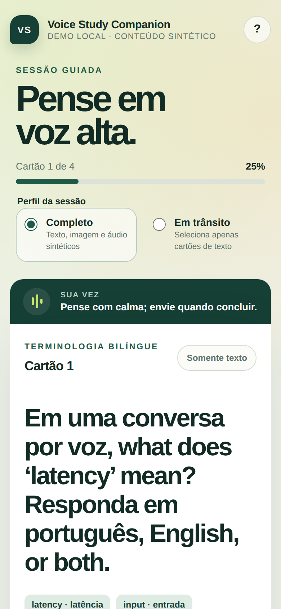
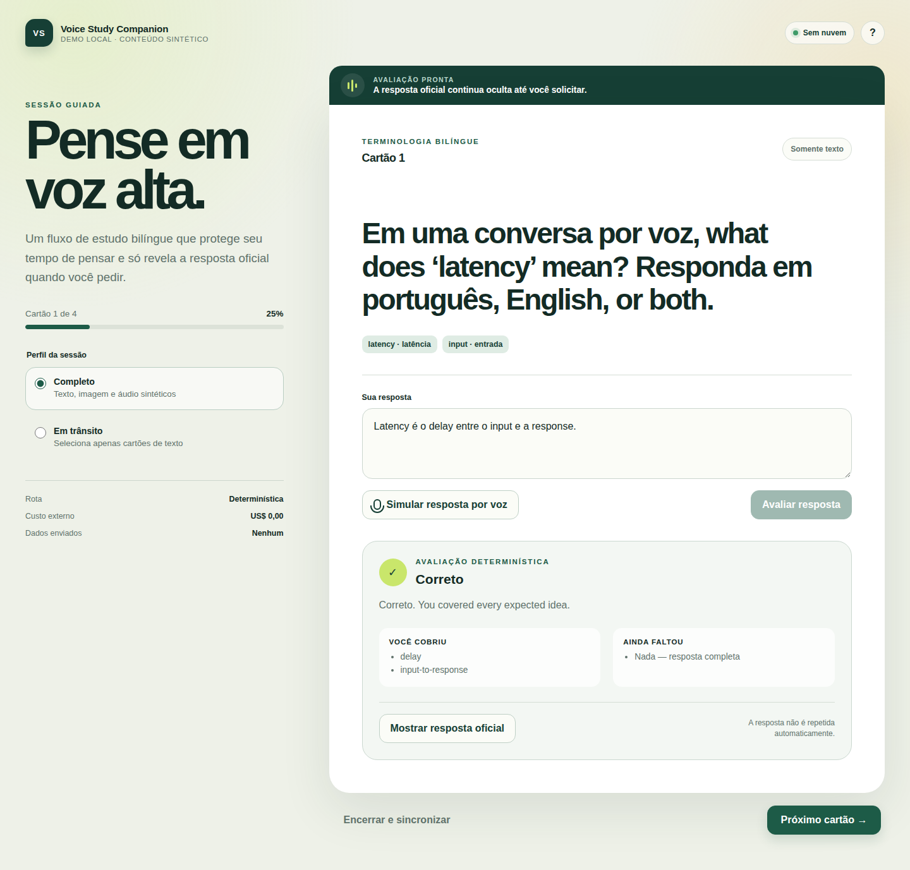
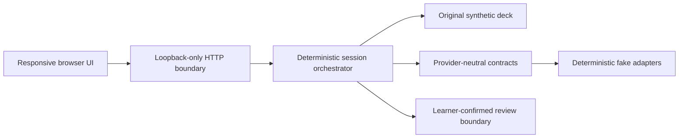

# Voice Study Companion

[](https://github.com/valdemarkjaer/voice-study-companion/actions/workflows/quality-gates.yml)

Voice Study Companion demonstrates a calmer voice-study workflow: think at
your own pace, receive structured feedback, and reveal the official answer only
when you ask for it. It runs locally without credentials or a paid provider.

Created by **Valdemar Katayama Kjaer** as a portfolio study in voice interaction,
explicit state boundaries, provider-neutral design, and reproducible evidence.

> **Scope:** source-repository portfolio showcase. It includes a loopback demo and
> reproducible evidence, but it is not a hosted service, production deployment,
> native application, or statement about any external environment.

The demonstration uses an original synthetic deck and deterministic fake
providers. It does not call a model API, read a real collection, require a
private network, or send learner data to a cloud service.

<!-- claim:credential_free_public_demo -->

## See it in about a minute

1. **0–10 s — Start locally.** Open the responsive study surface and choose
   either the complete or transit profile.
2. **10–25 s — Think aloud.** Read a bilingual synthetic prompt, then type a
   response or use the deterministic “simulate voice” control.
3. **25–40 s — Get bounded feedback.** The evaluator reports covered and
   missing concepts without exposing the official answer beforehand.
4. **40–50 s — Reveal deliberately.** Request the answer explicitly; only the
   answer side appears and the demo plays an unmistakably synthetic tone.
5. **50–65 s — Continue or close.** Advance manually or close the session and
   observe a simulated synchronization boundary.

<!-- claim:protected_preanswer_context -->
<!-- claim:official_answer_on_request -->





The reviewed short walkthrough is included at
[`media/demo/voice-study-walkthrough.webm`](media/demo/voice-study-walkthrough.webm).
Release media is included only after its pixels, audio, metadata, and generated
thumbnails pass the same public-boundary review as source files.

## Why this project exists

Spaced-repetition voice interfaces often make the learner adapt to a timer:
playback, microphone capture, grading, and reveal are treated as one loose
conversation. This project explores a stricter interaction model:

- the question and official answer have explicit lifecycle boundaries;
- pre-answer context structurally excludes the official answer;
- feedback can distinguish correct, partial, incorrect, and ungradable input;
- a learner, not an inference, remains responsible for review actions; and
- visual cards can be reserved when the learner selects a transit profile.

The result is a small reference implementation and portfolio case study, not a
clinical product or a replacement scheduler.

## Engineering highlights

- **Answer isolation by construction.** The official answer is absent from
  pre-answer context and crosses a separate reveal boundary only on request.
- **Provider-neutral contracts.** Transcription, evaluation, speech,
  synchronization, and review authority are independent interfaces exercised by
  deterministic local adapters.
- **Artifact-level verification.** CI installs and runs the built wheel, tests
  the full synthetic lifecycle in a network-isolated container, and exercises
  responsive and selected accessibility behavior in Chromium and WebKit.
- **Reviewable evidence.** Versioned claims, provenance, dependency licenses,
  media review, and clean-history export make limitations as inspectable as the
  implementation.

## Run the local demo

Prerequisites:

- Python 3.12 (the reviewed toolchain is pinned in `toolchain.lock.json`);
- a modern browser;
- no credentials, database, model download, or network service.

From the repository root:

```bash
export PYTHONDONTWRITEBYTECODE=1
export PYTHONPATH=src
export VSC_MODE=demo
python3 -m voice_study_companion.server
```

Open `http://localhost:8765`. The server deliberately accepts loopback binding
only. Stop it with `Ctrl+C`. Keep `VSC_MODE=demo`: names reserved for future
live-adapter configuration document a schema only, and the bundled server
rejects live mode because this showcase ships no live adapter.

To verify the installable artifact rather than run from the checkout:

```bash
python3 -m pip install --disable-pip-version-check \
  --require-hashes --no-deps -r requirements-build.lock
python3 -m pip wheel --disable-pip-version-check \
  --no-build-isolation --no-deps --wheel-dir dist .
artifact_root="$(mktemp -d)"
python3 -m venv "$artifact_root/venv"
"$artifact_root/venv/bin/python" -m pip install \
  --no-index --no-deps dist/*.whl
cd "$artifact_root"
VSC_MODE=demo "$artifact_root/venv/bin/voice-study-companion"
```

This builds from the checkout; the project is not presented as a PyPI release.

Run the dependency-free Python tests:

```bash
PYTHONDONTWRITEBYTECODE=1 PYTHONPATH=src \
  python3 -m unittest discover -s tests -p 'test_*.py' -v
```

Run the locked Chromium and WebKit viewport walkthroughs:

```bash
npm ci
npx playwright install chromium webkit
npm run test:browser
```

## Architecture at a glance



Transcription, evaluation, speech, synchronization, and media presentation are
separate contracts. The included demo implements them with deterministic local
adapters; a live adapter would have to satisfy the same answer-isolation,
grading, cancellation, and review-authority rules.

<!-- claim:provider_neutral_voice_core -->
<!-- claim:learner_confirmed_review -->

See [Architecture](docs/architecture.md) for the boundaries and
[Case study](docs/case-study.md) for the product decisions and trade-offs.

## Evidence, not slogans

Prominent statements in this README map to the versioned
[`evidence/claims.json`](evidence/claims.json) ledger.

| Capability | Evidence status | Scope |
| --- | --- | --- |
| Credential-free local demo | `AUTOMATED-VERIFIED` | Original synthetic cards and deterministic fakes; no paid API |
| Protected pre-answer context | `AUTOMATED-VERIFIED` | Official answer absent until the reveal boundary |
| Answer only on request | `AUTOMATED-VERIFIED` | Evaluating does not automatically show or speak the answer |
| Bilingual terminology | `AUTOMATED-VERIFIED` | Curated Portuguese/English behavior with a bounded glossary |
| Structured partial credit | `AUTOMATED-VERIFIED` | Study feedback only; never clinical judgment |
| Complete and transit profiles | `AUTOMATED-VERIFIED` | Transit selection explicitly excludes cards with media |
| Responsive web + selected accessibility checks | `AUTOMATED-VERIFIED` | Chromium/WebKit phone, tablet, and desktop walkthroughs with selected keyboard, focus, naming, contrast, reduced-motion, voice-status, and image checks; not a complete WCAG audit or device certification |
| Slow-recall aggregation | `EXPERIMENTAL` | Limited implementation outside this deterministic demo |
| Coordinated multidevice presence | `PLANNED` | Explicitly outside this showcase |

<!-- claim:bilingual_terminology -->
<!-- claim:structured_partial_credit -->
<!-- claim:media_aware_transit_study -->
<!-- claim:responsive_web_coverage -->
<!-- claim:slow_recall_aggregation -->
<!-- claim:multidevice_presence_boundary -->

## Privacy and cost

In demo mode, sessions live in process memory, static and generated media are
served from the loopback-only process, default request logging is disabled,
and no learner response is persisted. The fake speech output is generated
locally. The bundled demo makes no paid provider or model API calls, so its
external provider/API usage cost is **US$ 0.00**. This excludes local compute
and connectivity costs.

That statement does not predict the price or privacy posture of a future live
provider. Any such adapter must declare its route capabilities, retention
behavior, usage metering, and cost policy separately.

See [Data handling](docs/data-handling.md) and [Security](SECURITY.md).

## Anki compatibility boundary

Voice Study Companion is independently developed and is not affiliated with,
endorsed by, or sponsored by Anki or AnkiWeb. The design treats a user-owned
Anki installation as the authority for collection synchronization, due state,
and scheduling. The included public demo simulates that boundary and does not
open, modify, or synchronize a real collection.

<!-- claim:anki_compatibility_boundary -->

## Known limitations

- “Voice” in the credential-free demo is simulated input plus a deterministic
  audible tone; it is not natural speech synthesis or a live conversation.
- The demo is not medical advice and does not validate clinical correctness.
- Targeted Chromium/WebKit automation is not a complete WCAG conformance audit,
  Safari/iOS certification, native-app certification, real-device acceptance,
  or evidence for every phone/tablet lifecycle.
- The curated bilingual glossary is intentionally finite.
- No real collection, scheduler, media library, paid provider, or cloud sync is
  bundled.
- Background audio, ambient presence, and coordinated multidevice handoff are
  not shipped capabilities.

## Contributing and license

Before contributing, read [CONTRIBUTING.md](CONTRIBUTING.md). Security reports
follow [SECURITY.md](SECURITY.md); sensitive reports do not belong in a public
issue.

Project source is offered under the [Apache License 2.0](LICENSE). Dependency
and attribution details are recorded in
[THIRD_PARTY_NOTICES.md](THIRD_PARTY_NOTICES.md).
