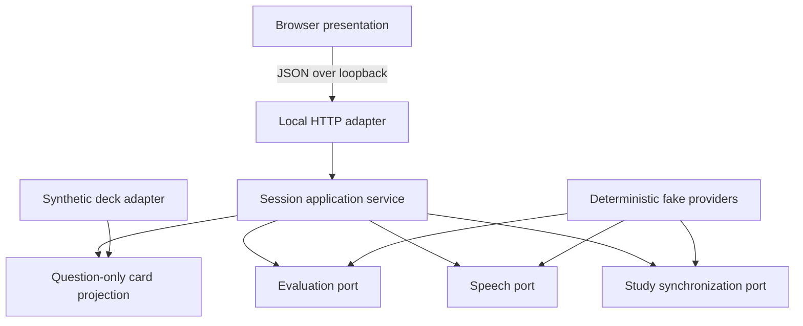

# Architecture

Voice Study Companion separates conversational ergonomics from study-system
authority. This document describes the public, credential-free candidate; it
does not describe any private deployment topology.

## Design goals

1. Keep the official answer unavailable to pre-answer evaluation.
2. Preserve learner control over reveal, advancement, and review actions.
3. Make speech, transcription, evaluation, synchronization, and transport
   replaceable without making their behavior ambiguous.
4. Support Portuguese, English, and mixed turns without treating a finite
   glossary as universal knowledge.
5. Demonstrate the interaction locally with synthetic content and no secrets.

## Component boundary



The browser receives a `PublicCard` projection with question text, terms, and
authorized media. That type has no official-answer field. The application
service can obtain the answer only after evaluation (or another explicit reveal
policy) and returns it through a dedicated endpoint.

<!-- claim:protected_preanswer_context -->

## Protected answer phases

The core workflow is a state machine, not an unrestricted chat transcript:

```text
session start
  -> question available
  -> learner response collected
  -> response evaluated
  -> quiet post-evaluation state
  -> official answer requested (optional)
  -> manual advance or close
```

Evaluation never implies reveal. Requesting the official answer exposes only
the answer side; explaining or repeating the question is a different intent.
The deterministic demo preserves this separation in its domain service, HTTP
responses, browser state, and tests.

<!-- claim:official_answer_on_request -->

In a live audio route, protected readings and open discussion require different
interruption policies. Official question/answer playback waits for correlated
producer completion and local-buffer drain. Open conversation may permit
barge-in. Fixed “number of seconds” timers are not the source of truth.

<!-- claim:phase_aware_audio_boundaries -->

## Provider-neutral contracts

The public contracts separate these responsibilities:

- audio input and transcription;
- question-safe dialogue context;
- structured evaluation;
- speech synthesis with an explicit purpose;
- card/media presentation profile;
- synchronization boundary and result;
- proposed versus confirmed study action.

An adapter is compatible only if it honors those semantics. Matching a method
signature is insufficient: malformed or contradictory grading must fail
closed, stale generation output must not affect a newer turn, and a proposed
review remains inert until confirmed by the learner.

<!-- claim:provider_neutral_voice_core -->
<!-- claim:structured_partial_credit -->
<!-- claim:learner_confirmed_review -->

The included adapters are deterministic fakes. This makes the walkthrough
repeatable and cheap, but does not establish compatibility with every model or
provider.

## Bilingual terminology

Language selection and terminology expansion are bounded application rules.
The tutoring layer can select Brazilian Portuguese, English, or a mixed mode;
expand curated abbreviations in context; and ask for clarification when an
abbreviation is ambiguous. Its glossary is deliberately bounded, and it does
not guarantee pronunciation.

<!-- claim:bilingual_terminology -->

## Media and transit selection

The complete profile may present text plus authorized synthetic media. The
transit profile is explicit, not inferred, and selects only cards that do not
require visual or audio interaction. It fails closed instead of silently
falling back to an unconstrained deck.

<!-- claim:media_aware_transit_study -->

## Anki scheduling boundary

Anki compatibility is an adapter boundary, not a fork of the scheduler. A
user-owned installation remains authoritative for collection sync, due state,
and scheduling. Reveal and review operations require explicit tokens and
idempotent application; the model cannot silently choose or submit a rating.

The credential-free demo uses an in-memory deterministic synchronizer. It does
not include Anki, access AnkiWeb, or modify a collection.

<!-- claim:anki_compatibility_boundary -->

## Recovery and failure behavior

- A malformed request receives a bounded public error, not an internal path or
  provider exception.
- Cross-origin and non-loopback requests are rejected by the demo server.
- An official answer cannot be fetched before the reveal operation.
- Correcting a transcript invalidates the previous evaluation in the live
  contract and requires reevaluation.
- Session close is idempotent in the application service.
- A future live adapter must report explicit reconnect and cancellation state;
  it cannot reinterpret failure as a confirmed review.

## Data flow in demo mode

All state is process-local:

1. the browser creates an in-memory session;
2. the server projects an original synthetic card;
3. simulated transcription returns a deterministic fixture response;
4. deterministic evaluation compares normalized concepts;
5. optional answer speech is generated as a synthetic WAV tone;
6. close records a simulated synchronization boundary and releases no external
   side effect.

No model endpoint, collection service, analytics sink, or external storage is
part of this path.

## Deliberate trade-offs

| Choice | Benefit | Cost |
| --- | --- | --- |
| Deterministic fakes | Reproducible and credential-free | No natural conversation claim |
| Loopback-only server | Small privacy and attack surface | Not a hosted demo |
| Explicit phase machine | Testable answer isolation | More ceremony than open chat |
| Learner-confirmed actions | Protects scheduling authority | Adds one deliberate interaction |
| Finite terminology rules | Predictable bilingual behavior | Cannot cover every abbreviation |
| Responsive web surface | One portable UI codebase | Native/background behavior remains unproven |

## Evidence boundary

Capability wording and status are versioned in
[`../evidence/claims.json`](../evidence/claims.json). `AUTOMATED-VERIFIED`
means covered by passing automated evidence; it is not a claim of universal
real-device behavior. Planned ambient or coordinated multidevice presence is
outside this showcase.

<!-- claim:responsive_web_coverage -->
<!-- claim:multidevice_presence_boundary -->
